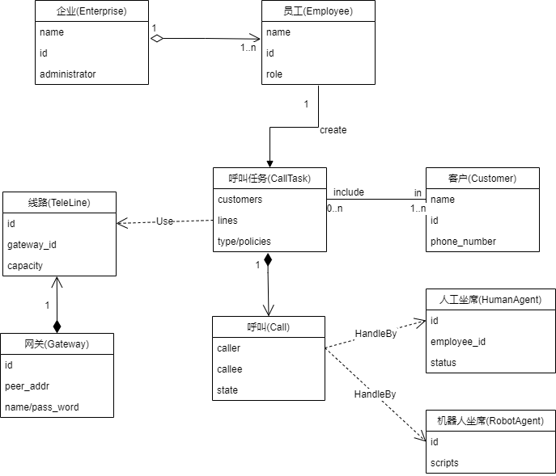
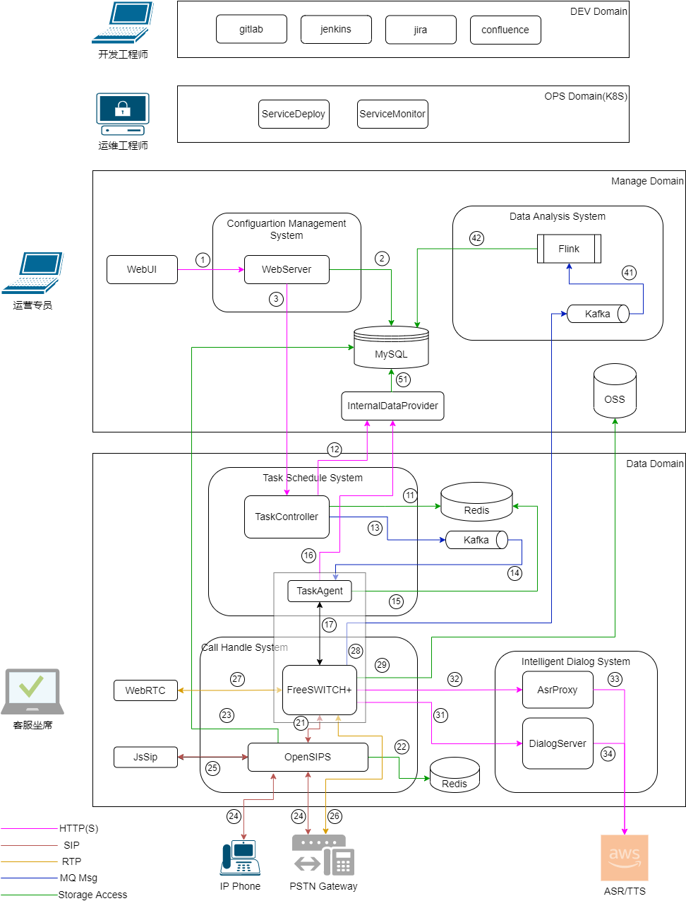

# 说明
本文简要介绍一种中小型、单数据中心的云端智能电话呼叫管理系统的设计。  
如需进一步了解，可邮件咨询：jonny.yin@outlook.com

# 需求概述
+ R1. 系统可以通过SIP与SIP Gateway对接，实现与PSTN电话号码（手机号码，固定电话号码）进行呼叫通话。
+ R2. 系统提供AI对话机器人，实现自动对话。
+ R3. 人工坐席可以通过浏览器接听电话，实现人工对话。
+ R4. 系统可进行预测式外呼：即先呼叫电话号码，号码接通后再呼叫人工坐席以节省坐席占用。系统可根据人工坐席数量及号码接通率自动调整并发呼叫数量以优化人工坐席效率。
+ R5. 对话过程中实时判断用户意图，根据意图将AI机器人对话的通话转移到人工坐席。
+ R6. 语音的识别处理，用户意图的判断准确率满足典型场景要求。
+ R7. 支持多租户。
+ R8. 随着客户/用户增加，系统可通过服务扩展正常运行。
+ R9. 系统具有高可用性。

# 业务模型
通过对业务需求中各部分进行抽象，建立一系列的对象及对象之间的关系。通过对象之间的交互以实现业务需求中功能性部分。

<a href="https://app.diagrams.net/#Hyinzhaoyang%2Fcaas%2Fmaster%2Faicc_models.drawio.png" target="_blank">Edit in diagrams.net</a>

简要说明：  
+ 系统内可存在多个企业，每个企业至少有一个角色为管理员的员工。  
+ 一个企业可以有多个不同角色的员工。  
+ 某种角色的员工可以创建管理呼叫任务。  
+ 呼叫任务包含待呼叫的客户信息，呼叫使用的线路，处理呼叫的人工坐席，机器人坐席信息。对每个客户号码，在呼叫任务中对应存在一个呼叫。  
+ 每个呼叫被处理过程中经历诸如创建、振铃、接通、完成等多种状态。每个呼叫任务可能被一个人工坐席或机器人坐席处理。  
+ 人工坐席由某种角色的员工创建，与某个员工关联。存在 离线、在线、繁忙、空闲 等不同状态。  
+ 机器人坐席有某种角色的员工创建。  
+ 线路属于某个网关，具有并发能力，占用量等属性。  

+ 呼叫任务(CallTask)和呼叫(Call)是系统中的核心对象，对这两个对象管理调度是系统需要提供的核心功能。

# 架构

基于云原生开发的DevOps流程，除了aicc系统架构，下图同时展示了开发和运维架构。

<a href="https://app.diagrams.net/#Hyinzhaoyang%2Faicc%2Fmaster%2Faicc_architecture.drawio.png" target="_blank">Edit in diagrams.net</a>

## 开发架构(DEV Domain)
git -- 代码管理  
jenkins -- 编译测试部署自动化jobs管理  
jira -- 需求及开发任务管理  
conflunce -- 共享文档管理  
对于个人开发者及小团队，建议直接使用DevOps-SaaS，如 [阿里云云效DevOps平台](https://devops.aliyun.com/)  

## 运维架构(OPS Domain)
运维架构基于Kubernates，具有以下优点：
+ 屏蔽不同运行环境(本地，不同云服务)差异。在本地环境可以先部署Kubernetes底座，其他云环境的Kubernate服务的部署运行基本一致。
+ Kubernates提供了强大的配置管理，服务调度，服务扩展能力。

## 业务系统架构
业务系统划分为两个域：运营管理域和业务流程域。
+ 业务场景不同：运营管理域向系统运营人员提供管理后台，进行各种配置(账号管理/坐席管理/线路管理/用户管理)及运营数据分析。业务流程域向终端用户提供通信服务。
+ 数据安全要求不同：运营管理域的服务向少数特定人员开放，通过认证鉴权等方式进行数据访问权限的控制。业务流程域仅需要支撑流程运行必须的数据，应与数据进行访问隔离。
+ 性能要求不同：业务流程域在流程处理速度稳定性上有更高的要求。
+ 扩展性要求不同：业务域需要随着用户增长进行动态扩容，运营管理域的系统能力相对稳定。

### 主要服务介绍
#### 运营管理服务
基于Web-Server前后端架构，为运营人员和坐席人员提供WebUI交互能力和相应的数据存取服务。具有较多的技术框架(Java, Nodejs, Python, ...)可以实现。推荐Java系列，参考实现和技术人员都非常丰富。

#### 任务调度服务
+ 什么是呼叫任务？  
呼叫任务是批量电话处理任务，其包含批量的被叫号码，使用的线路，接待机器人及人工坐席信息，处理策略等。

+ 任务控制器(Task Controller)  
根据任务信息，将呼叫任务拆分创建为单个的号码呼叫指令，发送到消息队列。

+ 任务代理(Task Agent)  
分布在具备任务处理能力的节点，从消息队列中获取呼叫指令，发送到呼叫处理系统处理。同时接收呼叫处理系统反馈的呼叫状态并根据呼叫策略进行呼叫的状态管理。

Task Controller/Task Agent是一种典型的 资源调度和分布式执行系统，可以参考K8S中的各种资源调度器的策略架构及实现。

#### 呼叫处理服务
呼叫处理服务，作为IP Telephony Server，需要提供以下能力:  
+ SIP Gateway对接管理
+ UA注册管理  
+ SIP呼叫信令处理  
+ 语音媒体处理  

可以使用开源的Kamailio/OpenSIPs实现registerar及sip-proxy功能，使用FreeSWITCH, Asterisk语音媒体处理功能。    
这里介绍使用OpenSIPs+FreeSwitch方案。

TaskAgent通过ESL接口向FreeSwitch发送指令，接受事件。  
FreeSwitch 采用Core + Extended Modules 架构，我们可以创建一个新的Endpoint Module与智能对话系统的交互实现机器人自动对话。  
(这一部分如果很多人有兴趣的话，有空时候我把之前零散笔记整理介绍一下。)

#### 智能对话服务
智能对话服务，从呼叫处理服务获得用户语音，进行ASR，再对ASR结果进行意图判断，由对话引擎进行对话驱动。  
ASR/TTS推荐使用优质第三方服务，意图识别及对话引擎进行自研以满足业务场景的灵活需求。  

#### 实时数据分析系统
根据业务需求，数据分析通常有两种模式：  
批量数据处理, 通常用来处理周期性的经营数据分析。  
实时数据处理，业务流程中实时对业务处理数据进行分析并反馈驱动业务流程。  
这里描述的是实时数据处理系统。

在我们设定的系统要求中，要在用户通话过程中对用户进行实时画像以决定当前呼叫的后续处理策略（挂机，转人工，应答内容 等）。

这里使用Kafka进行数据异步采集，Flink从Kafka获得数据，实时计算后结果存入MySQL数据库。如果业务流程需要实时反馈，也可将结果发送到Kafka，相关服务从Kafka获得结果即时进行业务流程的处理。

### 交互消息及典型用例
以下消息编号Mx对应于架构图中的交互编号。  
M1.  &ensp;WebUI向WebServer发送运营人员的运营管理请求，如任务配置。  
M2.  &ensp;WebServer将配置信息写入MySQL数据库。  
M3.  &ensp;WebServer通知TaskController有任务变更。  
M11. TaskController优先从Redis获取任务信息。  
M12. TaskController通过InternalDataProvider从MySQL获取任务信息并写入Redis。  
M13. TaskController根据呼叫任务创建呼叫指令，通过Kakfa发布。  
M14. TaskAgent订阅获得来自Kafka的呼叫指令。  
M15. TaskAgent从Redis获取处理呼叫指令所需其他信息。  
M16. TaskAgent按需通过InternalDataProvider从MySQL获取任务信息并写入Redis。  
M17. TaskAgent初始化呼叫状态后，通过ESL接口向FreeSwitch发送呼叫指令。  
M21. FreeSwitch向OpenSips发送接受SIP-INVITE及其他SIP消息创建Session。FreeSwitch启动时向OpenSips注册。   
M22. OpenSips从Redis获取目标号码的注册信息。  
M23. OpenSips按需从MySQL获取目标号码注册信息并写入Redis。  
M24. OpenSips向目标网关发送接受SIP消息。网关已经向OpenSips注册。  
M25. OpenSips向浏览器坐席JsSip发起呼叫。  
&ensp;&ensp;&ensp;&ensp;&ensp;&ensp;在M24之后，FreeSwitch将外部呼叫状态发送到TaskAgent。  
&ensp;&ensp;&ensp;&ensp;&ensp;&ensp;TaskAgent根据呼叫信息判断电话由人工坐席或机器人接听，并发送呼叫指令到FreeSwitch。重复类似M21\~M23的交互。  
M26. FreeSwitch与PSTN Gateway建立媒体传输通道进行语音传输。  
M27. FreeSwitch与人工坐席浏览器WebRTC建立媒体传输通道进行语音传输。  
M28. FreeSwitch将电话交互信息发布到Kafka。  
M29. FreeSwitch将电话交互语音发送发到Object Storage保存。  
M31. FreeSwitch将用户语句发送到DialogServer由AI-Robot进行对话应答。  
M32. FreeSwitch将用户语音片段发送到AsrProxy进行语音转文字处理。  
M33. AsrProxy进行必要的语音处理(如噪音识别排除)后使用ASR服务处理。  
M34. DialogServer按需使用TTS服务将应答文字转化为语音并发送到FreeSwitch传到用户端。  
&ensp;&ensp;&ensp;&ensp;&ensp;&ensp;M31\~M34在AI机器人处理电话场景下使用。  
&ensp;&ensp;&ensp;&ensp;&ensp;&ensp;M25/M27在人工坐席处理电话场景下使用。  
M41. Flink从Kafka接收FreeSwitch发布的对话信息进行实时计算处理。  
M42. Flink将实时计算处理结果写入MySQL。  

## 高可用(HA)设计

本系统暂不考虑异地多数据中心的容灾设计，对多活容灾架构感兴趣的码友可查看另一篇关于多数据中心CaaS架构的介绍。  

HA设计从整体到局部进行考虑。

+ Telephony-AICC 作为一个整体服务，对外提供服务的稳定性，扩展性，处理效率。
+ Telephony-AICC 内部各服务的稳定性，扩展性，处理效率。

